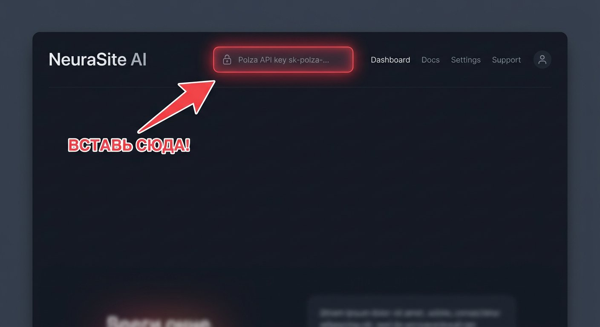

# ⚡ NeuraSite AI — Генератор сайтов на Polza AI

> Современный AI-генератор лендингов и веб-сайтов «под ключ» с адаптивной версткой, анимациями Tailwind CSS + GSAP, чат-доработкой и интеграцией с Polza AI.



## 🌐 Демо и запуск

- **GitHub Pages (прямой запуск в браузере):**  
  👉 [https://kosvip369-pixel.github.io/Neyrogenerator/](https://kosvip369-pixel.github.io/Neyrogenerator/)
- **Локальный запуск (с FastAPI бэкендом):**  
  `http://localhost:8000`

---

## ✨ Что умеет генератор

1. **Генерация за 30 секунд:**
   - Один автономный HTML файл со стилями и скриптами (Tailwind CSS CDN + Google Fonts + GSAP анимации).
   - Адаптив под Desktop, Tablet и Mobile.
   - Подбор релевантных фотографий через Unsplash API.
2. **Готовые шаблоны (в 1 клик):**
   - 🚀 SaaS & AI Стартапы (стиль Linear, Stripe, Vercel)
   - ☕ Кофейни & Рестораны (уютный минимализм с меню и картой)
   - 🏥 Медицинские центры & Косметология (премиум доверие)
   - 💪 Фитнес-клубы & Спорт (мощный брутализм)
   - 🏢 Недвижимость & Девелопмент (корпоративный синий)
   - ✨ Салоны красоты & SPA (Glassmorphism и нежные градиенты)
3. **Интерактивный предпросмотр:**
   - Переключение между Desktop, Tablet и Mobile.
   - Полноэкранный режим и открытие в новой вкладке.
   - Просмотр и 1-клик копирование исходного кода.
   - Скачивание готового `.html` файла.
4. **ИИ-чат доработки:**
   - Можно попросить ИИ: *«Сделай темнее»*, *«Добавь блок с отзывами»*, *«Поменяй цвет кнопок на изумрудный»* — и сайт моментально обновится.
5. **Встроенный генератор картинок и поиск по Unsplash:**
   - Вставка подходящих фото прямо в верстку сайта.

---

## 🚀 Быстрый старт

### Вариант 1: В браузере (без установки)
Просто откройте `index.html` двойным кликом или перейдите на [GitHub Pages](https://kosvip369-pixel.github.io/Neyrogenerator/).  
Ключ Polza AI уже преднастроен и готов к работе!

### Вариант 2: Локально с Python (FastAPI)
```bash
# Клонируйте репозиторий
git clone https://github.com/kosvip369-pixel/Neyrogenerator.git
cd Neyrogenerator

# Установите зависимости
pip install -r requirements.txt

# Запустите сервер
python generator_server.py
```
Откройте браузер: [http://localhost:8000](http://localhost:8000)

### Вариант 3: Docker
```bash
docker compose up -d
```
Сайт доступен на `http://localhost:8000`.

---

## 🔑 Ключ Polza AI

По умолчанию в генератор уже встроен рабочий ключ. Если вы хотите использовать собственный ключ:
1. Зарегистрируйтесь на [polza.ai](https://polza.ai/register).
2. Создайте API ключ в личном кабинете (`pza_...` или `sk-...`).
3. Вставьте его в поле 🔑 в правом верхнем углу интерфейса и нажмите **OK**.
4. Ключ сохранится в вашем браузере (`localStorage`).

Подробная инструкция: см. файл [KEYS.md](KEYS.md) и [START_HERE.html](START_HERE.html).

---

## 📁 Структура проекта

```
Neyrogenerator/
├── index.html            # Главный интерфейс генератора (PWA/SPA)
├── generator.html        # Алиас для прямой совместимости
├── generator_server.py   # FastAPI бэкенд (прокси Polza AI + статика)
├── polza_models.json     # Конфигурация доступных LLM моделей
├── templates.json        # База готовых промптов и шаблонов для ниш
├── START_HERE.html       # Визуальная инструкция по ключам
├── KEYS.md               # Документация по ключам Polza
├── TUTORIAL.md           # Обучение и сценарии работы
├── requirements.txt      # Python зависимости
├── Dockerfile            # Сборка контейнера
├── docker-compose.yml    # Удобный запуск в Docker
└── .github/workflows/    # CI/CD для GitHub Pages
```

---

## 🛠 Технологический стек

- **Frontend:** HTML5, Modern Vanilla JS, Tailwind CSS, GSAP 3.x, Lucide Icons, Space Grotesk / Manrope.
- **Backend:** FastAPI, Uvicorn, AsyncOpenAI, HTTPX, Pydantic v2.
- **AI Core:** Polza AI API (Claude 3.5/4.5 Sonnet, GPT-5, Gemini 2.5 Pro, DeepSeek V3.2, Qwen 235B, Seedream 4.5).
